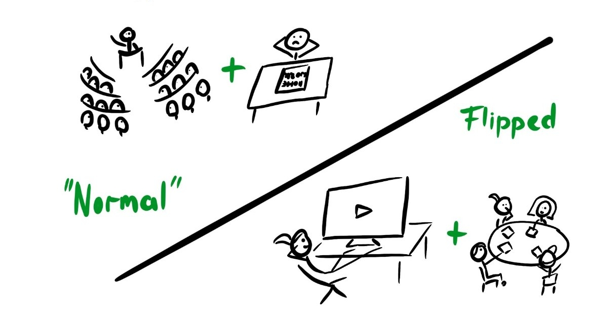
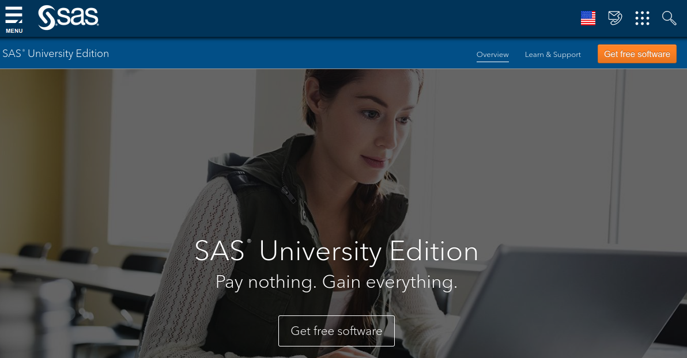

```{r child = "setup.Rmd"}
```

```{r set-theme, include=FALSE}
library(xaringanthemer)
style_duo_accent(
  primary_color      = "#003C71", # pantone classic blue
  secondary_color    = "#009FDF", # pantone baby blue
  header_font_google = google_font("Raleway"),
  text_font_google   = google_font("Raleway", "300", "300i"),
  code_font_google   = google_font("Source Code Pro"),
  text_font_size     = "30px"
)
```


```{r load-packages, message=FALSE, echo=FALSE}
knitr::opts_chunk$set(echo = TRUE, 
                      message = FALSE, 
                      warning = FALSE, 
                      out.width = '70%', 
                      fig.align = 'center', 
                      tidy = FALSE)
options(scipen = 1, digits = 3)
library(ggplot2, warn.conflicts = FALSE, quietly = TRUE)
theme_set(theme_minimal())
```

```{r xaringanExtra, echo=FALSE}
xaringanExtra::use_xaringan_extra(c("tile_view", "editable","panelset", "tachyons","webcam"))

```

# Bienvenue


.pull-left-narrow[
```{r fig.align="center", echo=FALSE, alt="Leo", out.width="80%"}

```
]
.pull-right-wide[
.midi[
- Professeur adjoint, Sciences de la décision
- Spécialité: modélisation d'événements rares
- Je suis plus facilement joignable par *courriel:* [`leo.belzile@hec.ca`](mailto:leo.belzile@hec.ca)


[Et vous? Faisons connaissance!](https://etherpad.wikimedia.org/p/QJxypvl4sxCRynWIDUbL)
- Origine
- Formation précédente
- Ville/région/pays actuel
- Quelles sont vos attentes par rapport au cours?
]
]

---

# Organisation

- Rencontres hebdomadaires via **Zoom** les lundi 8h30-11h30.
- Tout le matériel est disponible via le site web du cours: [`https://lbelzile.github.io/modstat/`](https://lbelzile.github.io/modstat/)
.midi[
- notes de cours
- capsules vidéo
- quiz
- exercices et solutionnaires
- démo **SAS**/**R**
    ]
- Soumissions de travaux via *ZoneCours*
- Publiez vos questions de cours sur **Piazza**: [`piazza.com/hec.ca/fall2020/math60604`](piazza.com/hec.ca/fall2020/math60604)

---

# Contenu du cours 


> *Tous les modèles sont faux, mais certains sont utiles.* 
.right[— Georges Box]


1. Principes fondamentaux de modélisation et d’inférence statistique
2. Modèles linéaires
3. Modèles linéaires généralisés
4. Modèles pour données longitudinales et corrélées
5. Modèles linéaires mixtes
6. Introduction à l’analyse de survie

---


# Évaluations

- Trois devoirs, chacun 15% (premier devoir en équipes)
    - questions courtes (choix multiples)
    - questions à développement avec programmation
    - analyse de données
--
- Un projet d'analyse de données (25%)
    - créez un devoir!
--
- Examen final (30%, format à déterminer selon les directives de HEC) 
 
---

## Innovation pédagogique, version pandémie!

.center[
```{r fig.align="center", echo=FALSE, out.width="80%"}

```
.small[
Classe inversée (illustration de Heidi Seibold, sous licence CC-BY 4.0)
]
]


---


.question[
Quel est le format du cours?
]

--
.pull-left[
À la maison:
- lectures avec vidéos d'accompagnement
- questionnaires à choix multiples sur le contenu
- exercices et problèmes avec solutionnaires
]

--

.pull-right[
En classe:
- récapitulatif hebdomadaire
- séance de réponse aux questions
- ateliers en groupe et discussion.
]

---

.question[
Quelle est la charge de travail de ce cours?
]

--

- 3 crédits = 135 heures de travail
- une moyenne de 9 heures par semaine
- ne sous-estimez pas l'investissement initial nécessaire 
    - installation de logiciels
    - apprentissage de la programmation
    - mise à jour des connaissances

---

.question[
Quelle est la clientèle cible du cours?
]

--

Étudiant(e)s du programme de sciences des données et analytique d'affaires. 

Les étudiant(e)s admis(es) ont normalement un diplôme de premier cycle en
 - ingénierie, 
 - physique ou 
 - mathématique.

Une certaine familiarité mathématique (algèbre linéaire, calcul) est assumée.

---

.question[
Quels sont les prérequis pour ce cours?
]

--

Un premier cours de statistique couvrant les notions suivantes:

.pull-left[
+ axiomes de probabilité
+ variables aléatoires
    + espérance et variance
    + lois discrètes: Bernoulli, binomiale, Poisson
    + lois continues: uniforme, exponentielle, normale
]

.pull-right[
+ statistiques descriptives
+ tests d'hypothèse
+ comparaison de moyennes et proportions (un et deux échantillons)
+ régression linéaire simple et corrélation
]

---

.question[
Est-ce qu'il y aura de la programmation?
]

--
.sample-answer[
*Oui*. Nous couvrirons les fonctionnalités de base de **SAS** (et **R**) pour l'ajustement des modèles et la visualisation des données. 
]

- Le code sera fourni uniquement pour les exercices en classe et les ateliers.
- Vous devrez remettre votre code avec vos devoirs.


---

.question[
Quels logiciels utilisera-t-on en classe?
]

Selon le plan de cours, **SAS** (version de base). Vous devez l'installer sur votre ordinateur et suivre la capsule vidéo pour vous familiariser avec son utilisation.

--

- C'est le seul cours de votre programme qui utilise ce langage de programmation.
.midi[
- avantage comparatif si vous maîtrisez plusieurs langages
- principalement utilisé en entreprise
    - de nombreuses entreprises gèrent leur base de données avec **SAS**
    - coûte bonbon ($ $ $)
    - stabilité et soutien
    - leg important de code en entreprise freine l'évolution
]

---

 Je recommande  (et surtout pour les systèmes Unix) [la version gratuite **SAS University Edition**](https://www.sas.com/en_us/software/university-edition.html) (machine virtuelle, via navigateur web)

.center[
```{r fig.align="center", echo=FALSE, alt = "SAS University Edition", out.width="60%"}

```
]

.midi[
Les TIs fournissent aussi le logiciel pour Windows via leur plateforme [(~35$ pour le téléchargement)](https://www.hec.ca/dti/assistance/pedagogie/logiciels_enseignes/Procedure-SAS.pdf).
]

---

### **R**

Je suis un (fervent) partisan du libre-accès et de **R**, un langage de programmation/logiciel écrit par la communauté

 - c'est gratuit!
 - support multi système d'exploitation
 - téléchargement via [cran.r-project.org](https://cran.r-project.org/)
 - utilisé dans les notes de cours
 - je recommande l'environnement de développement [**RStudio**](https://rstudio.com/)
 
---

.question[
Quelles sont les attentes de l'enseignant?
]

--

- Participation active: présence supposée au cours (virtuel)
.midi[
- si pas possible, faites-le moi savoir
- discussions en petits groupes
- posez des questions! il n'y a pas de question stupide
]
--

- Autonomie: vous êtes responsables de votre apprentissage.
.midi[
- être à jour et faire les lectures avant le cours
- ne laissez pas l'obscurantisme vous gagner: posez des questions (à moi, à vos pairs)!
]
--

- Rétroaction: des problèmes? faites-en part rapidement
.midi[
- semestre en ligne = points de friction (connexion, manque de rapports humains, etc.)
- nombreux outils = période d'adaptation
]
---

# Environnement inclusif et respectueux

Bien que virtuel, l'environnement de classe doit être respectueux. Les remarques déplacées, le harcèlement, etc. ne seront pas tolérés.

--

Faites-moi savoir si 

- je peux faire quelque chose pour améliorer le cours pour vous, pour les autres étudiant(e)s et le groupe
- une remarque vous rend inconfortable
- vous avez un nom/pronom/genre qui diffère de celui présent sur *HEC en ligne*
- votre performance est affectée par des expériences externes au cours: je ferai mon possible pour vous aider ou vous diriger vers des ressources extérieures

---

# Plagiat

Vous devez fournir le code (et les données) afin que je puisse reproduire *exactement* vos analyses.
.midi[
- fichier `.txt`, encodage UTF8 (sinon, *Zonecours* vous empêchera de soumettre votre travail)
- suivez les consignes (voir instructions) pour nommer vos scripts 
(indice: $\neq$ `moncode.sas`)
- si vous vous inspirez de code écrit par d'autres (par ex., `StackOverflow`), citez adéquatement vos sources.
- vous devez programmer vous-même votre code pour les travaux individuels (discussion avec vos pairs acceptée, mais tout partage de code et copier-coller est une infraction au code de conduite de l'école)

]

