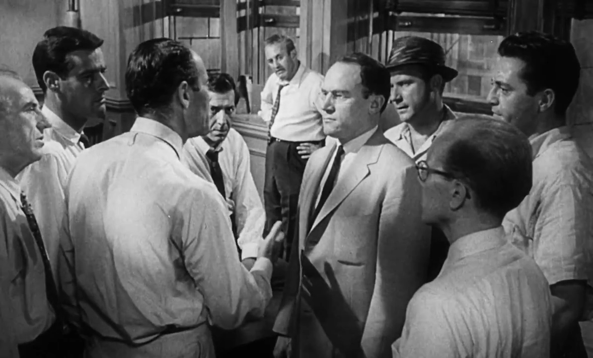
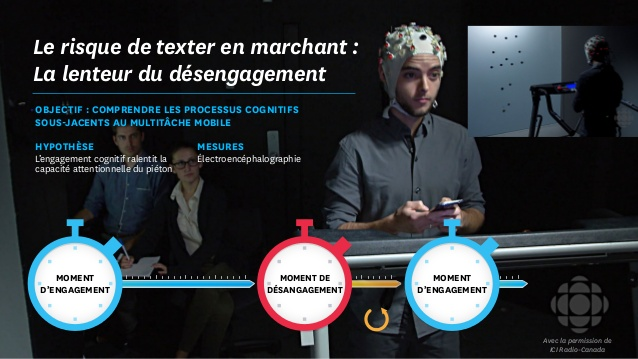
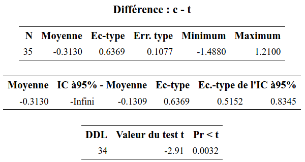
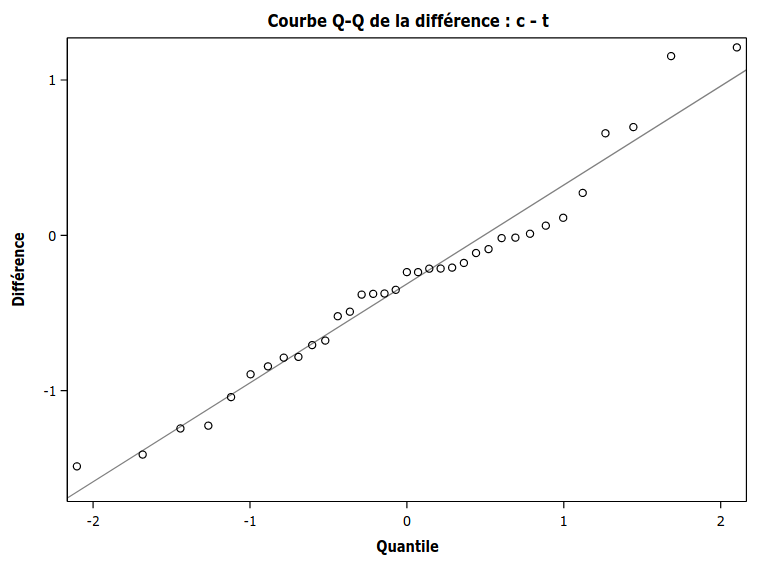

```{r child = "setup.Rmd"}
```

```{r set-theme, include=FALSE}
library(xaringanthemer)
style_duo_accent(
  primary_color      = "#003C71", # pantone classic blue
  secondary_color    = "#009FDF", # pantone baby blue
  header_font_google = google_font("Raleway"),
  text_font_google   = google_font("Raleway", "300", "300i"),
  code_font_google   = google_font("Source Code Pro"),
  text_font_size     = "30px"
)
```


```{r load-packages, message=FALSE, echo=FALSE}
knitr::opts_chunk$set(echo = TRUE, 
                      message = FALSE, 
                      warning = FALSE, 
                      out.width = '70%', 
                      fig.align = 'center', 
                      tidy = FALSE)
options(scipen = 1, digits = 3)
library(ggplot2, warn.conflicts = FALSE, quietly = TRUE)
theme_set(theme_minimal())
```


```{r xaringanExtra, echo=FALSE}
xaringanExtra::use_xaringan_extra(c("tile_view", "editable","panelset", "webcam"))
htmltools::tagList(
  xaringanExtra::use_clipboard(
    button_text = "<i class=\"fa fa-clipboard\"></i>",
    success_text = "<i class=\"fa fa-check\" style=\"color: #90BE6D\"></i>",
    error_text = "<i class=\"fa fa-times-circle\" style=\"color: #F94144\"></i>"
  ),
  rmarkdown::html_dependency_font_awesome()
)
xaringanExtra::use_extra_styles(
  hover_code_line = TRUE,         #<<
  mute_unhighlighted_code = TRUE  #<<
)
```

# Tests d'hypothèse

Analogie du procès

```{r twelveangrymen, echo = FALSE, out.width="65%"}

```
.figcaption[Capture d'écran du drame judiciaire _Douze hommes en colère_ (1957)]

---

### Étapes de la démarche


1. Définir les variables d'intérêt
2. Formuler les hypothèses alternatives et nulles, $\mathscr{H}_1$ et $\mathscr{H}_0$
3. Choisir la statistique de test
4. Comparer la valeur numérique obtenue à la loi nulle
5. Obtenir une valeur-*p*
6. Conclure dans le contexte du problème

---

### Tech3Lab


```{r tech3lab, echo = FALSE, out.width="85%"}

```


---

### Les dangers de texter en marchant


```{r texter, echo = FALSE, out.width="85%"}

```

---

### Détails de l'étude

- 35 sujets ont participé à l'étude. 
- Chaque personne devait marcher sur un tapis roulant et un écran projetait des obstacles. 
- Au cours d'une séance, le sujet marchait en parlant au cellulaire tandis que lors d'une autre séance, il devait marcher en textant. 
- L'ordre entre les séances a été déterminé *au hasard*.
- Différents obstacles étaient présentés durant une séance selon un ordre aléatoire. 
- Nous allons nous intéresser à l'un d'eux, l'apparition d'un cycliste dans le champ visuel

---

### Caractéristiques

- Population: adultes (18 ans et plus)
- Échantillon: 35 individus
- Variables:
  - temps pour percevoir un obstacle: quantitatif
  - type de distraction (cellulaire ou textos): nominale

 


On s'intéresse au temps (en
secondes) que prend une personne pour apercevoir cet obstacle (mesuré à l'aide d'un encéphalogramme).

---

### \#1. Définir les variables d'intérêt

Définissons
- $\mu_{\texttt{c}}$: moyenne du temps de réaction (en secondes) lors d'un appel (`c`)
- $\mu_{\texttt{t}}$: moyenne du temps de réaction (en secondes) lorsqu'on texte (`t`)

--

### \#2. Formuler les hypothèses alternatives et nulles

- Hypothèse d'intérêt: est-ce que texter est plus distrayant?
    - $\mathscr{H}_1: \mu_{\texttt{t}} > \mu_{\texttt{c}}$ (unilatéral)
- Hypothèse nulle (avocat du Diable)
    - $\mathscr{H}_0: \mu_{\texttt{t}} \leq  \mu_{\texttt{c}}$

On exprime l'hypothèse en fonction de la différence: $\mathscr{H}_1: \mu_{\texttt{t}} - \mu_{\texttt{c}}>0$.

---

### \#3. Choisir la statistique de test

On s'intéresse à la différence de temps de réaction (moyenne)

- Test-_t_ pour un échantillon pour $\texttt{t}-\texttt{c}$ (un test-_t_ pour données appariées) 
\begin{align*}
T_D=\frac{\overline{D}-\mu_0}{\mathsf{se}(\overline{D})}
\end{align*}
- $\overline{D}$ est la moyenne dans l'échantillon des différences $D_i$ de temps de réaction entre texter et marcher pour chaque sujet $i$. 
- On postule $\mu_0=\mu_{\texttt{t}}-\mu_{\texttt{c}}=0$.
- L'erreur-type de $\overline{D}$ est $\mathsf{se}(\overline{D})=S_D/\sqrt{n}$, où $S_D$ est l'écart-type des variables $D_i$ et $n$ est la taille de l'échantillon.


---

.panelset[

.panel[.panel-name[Sortie **SAS**]
.pull-left[
```{r distraction_SAS1, echo = FALSE, out.width="100%"}

```
]
.pull-right[
```{r distraction_SAS2, echo = FALSE, out.width="100%"}

```
]

]
.panel[.panel-name[Code **SAS**]

```{sas distraction_code_SAS, echo = TRUE, eval = FALSE}
proc ttest data=modstat.distraction side=l;
paired c*t;
run;
```

]
.panel[.panel-name[Sortie **R**]

```{r distraction, eval = TRUE, echo = FALSE}
url <- "https://lbelzile.bitbucket.io/MATH60604/distraction.sas7bdat"
distraction <- haven::read_sas(url)
with(distraction,
     t.test(t-c, alternative = "greater", mu = 0) 
     )
```
]
.panel[.panel-name[Code **R**]
```{r distraction_code, eval = FALSE, echo = TRUE}
url <- "https://lbelzile.bitbucket.io/MATH60604/distraction.sas7bdat"
distraction <- haven::read_sas(url)
with(distraction,
     t.test(t-c, alternative = "greater", mu = 0) 
     )
```
]


]

---

### \#4. Comparer la valeur numérique obtenue à la loi nulle

La loi nulle est Student-_t_ avec 34 degrés de liberté, $\mathsf{St}_{34}$. 

On s'intéresse uniquement à la probabilité d'obtenir $T_D > 2.91$ sous $\mathscr{H}_0$.

--

### \#5. Obtenir une valeur-*p*

La valeur-_p_ est $0.0032$, inférieure à $\alpha=5\%$.

### \#6. Conclure dans le contexte du problème

On rejette $\mathscr{H}_0$: le temps de réaction est significativement plus élevé lorsqu'on texte que lorsqu'on parle au cellulaire en marchant. 

La différence moyenne estimée est $0.313$ secondes.

