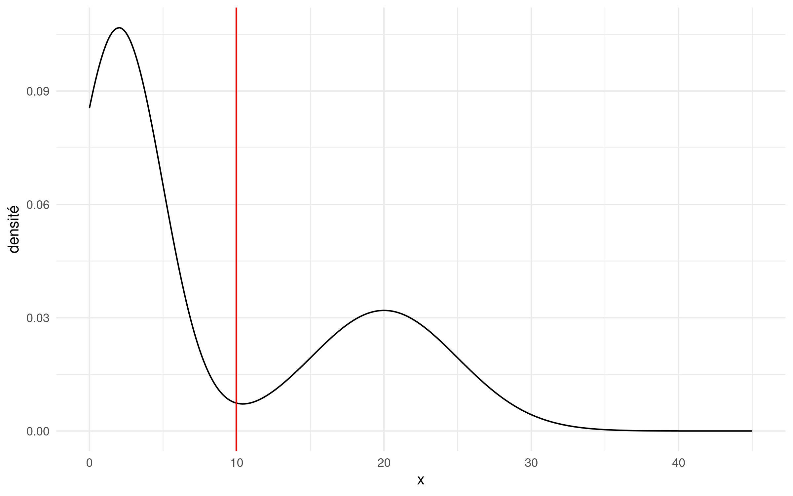
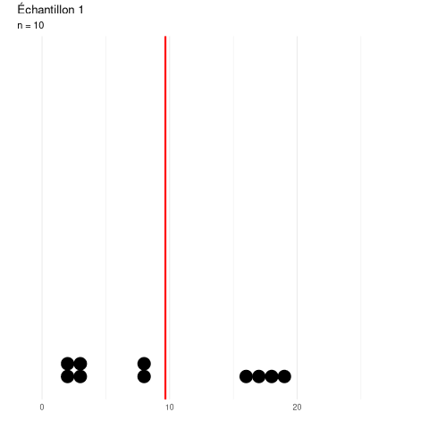
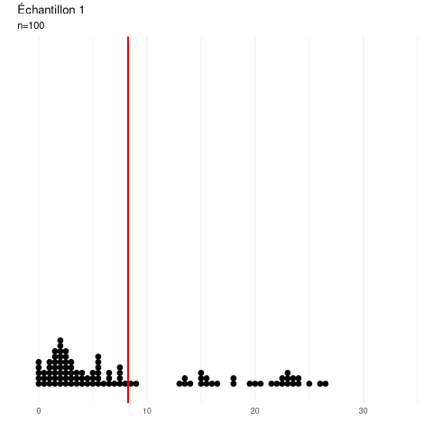
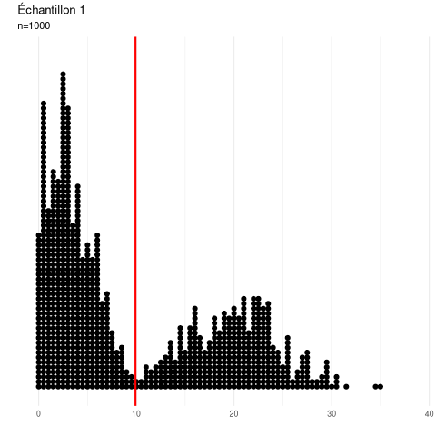
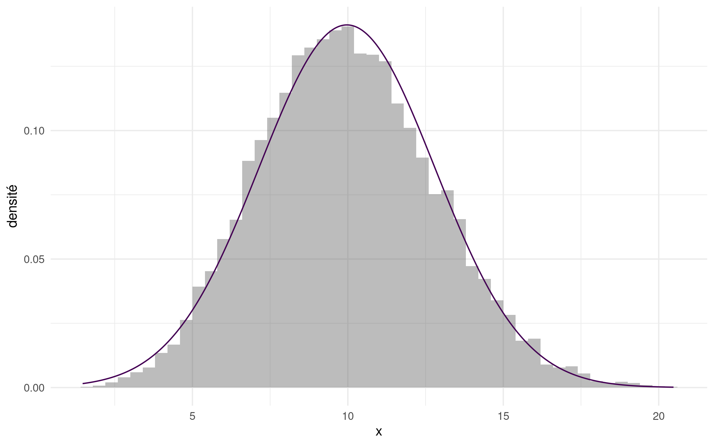
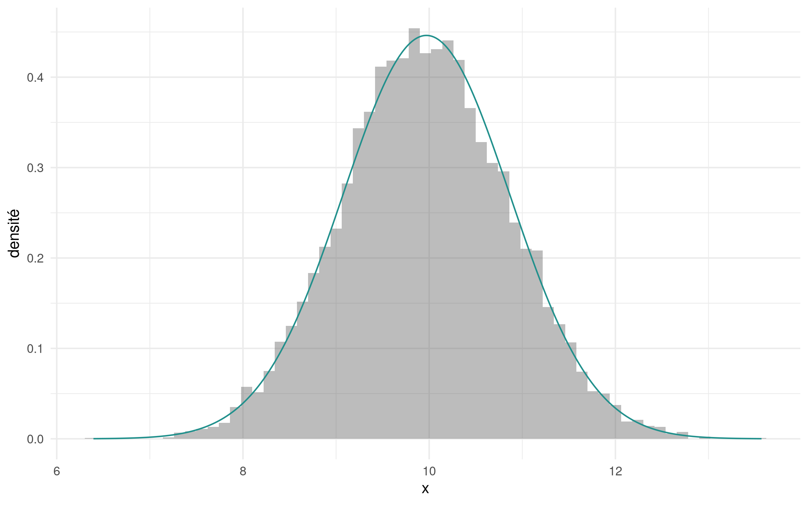
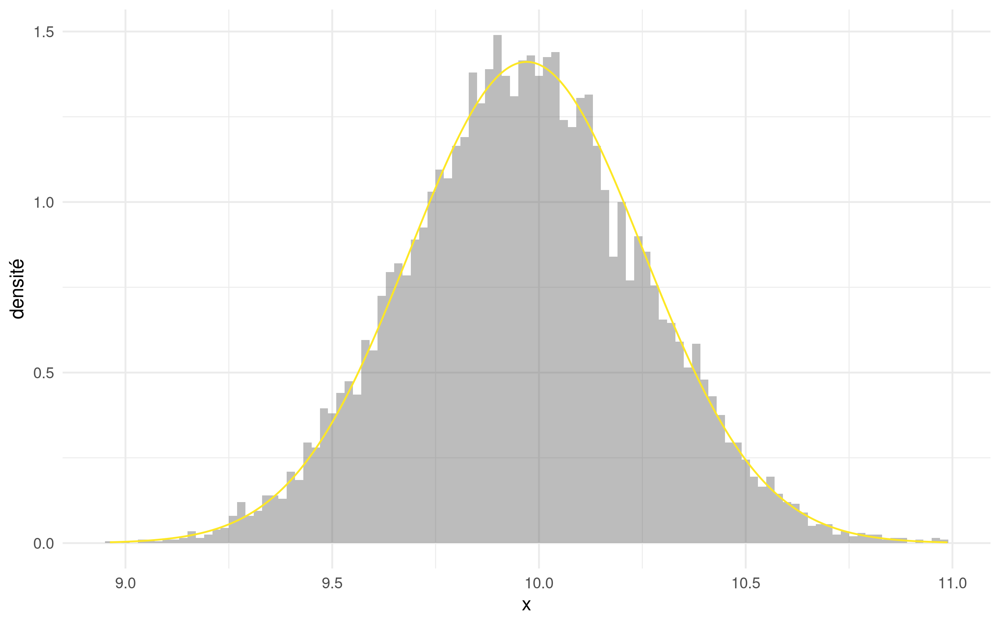
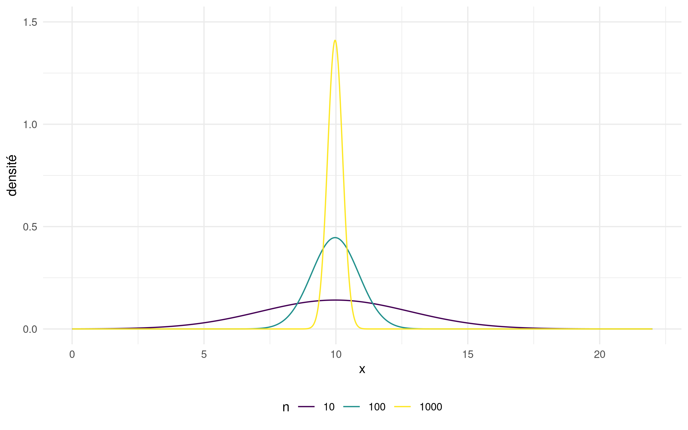

```{r child = "setup.Rmd"}
```

```{r set-theme, include=FALSE}
library(xaringanthemer)
style_duo_accent(
  primary_color      = "#003C71", # pantone classic blue
  secondary_color    = "#009FDF", # pantone baby blue
  header_font_google = google_font("Raleway"),
  text_font_google   = google_font("Raleway", "300", "300i"),
  code_font_google   = google_font("Source Code Pro"),
  text_font_size     = "30px"
)
```


```{r load-packages, message=FALSE, echo=FALSE}
knitr::opts_chunk$set(echo = TRUE, 
                      message = FALSE, 
                      warning = FALSE, 
                      out.width = '70%', 
                      fig.align = 'center', 
                      tidy = FALSE)
options(scipen = 1, digits = 3)
library(ggplot2, warn.conflicts = FALSE, quietly = TRUE)
theme_set(theme_minimal())
xaringanExtra::use_xaringan_extra(c("tile_view", "editable","panelset", "webcam"))
htmltools::tagList(
  xaringanExtra::use_clipboard(
    button_text = "<i class=\"fa fa-clipboard\"></i>",
    success_text = "<i class=\"fa fa-check\" style=\"color: #90BE6D\"></i>",
    error_text = "<i class=\"fa fa-times-circle\" style=\"color: #F94144\"></i>"
  ),
  rmarkdown::html_dependency_font_awesome()
)
xaringanExtra::use_extra_styles(
  hover_code_line = TRUE,         #<<
  mute_unhighlighted_code = TRUE  #<<
)
```

# Loi nulle 

Lorsqu'on effectue un test statistique, on doit connaître la loi nulle afin de tirer une conclusion (rejeter ou ne pas rejeter $\mathscr{H}_0$)

La statistique de test est souvent 
- une moyenne
- un paramètre estimé par maximum de vraisemblance

Dans ces cas, sous des hypothèses de régularité, la loi nulle est normale. Pourquoi?

---

# Théorème central limite (informel)

Si $Y_1, \ldots, Y_n$ est un échantillon aléatoire simple d'une population 
- d'espérance $\mu$,
- de variance $\sigma^2$ finie.

Alors la loi de la moyenne empirique $\overline{Y}_n$ est approximativement normale centrée en $\mu$ et de variance $\sigma^2/n$.

\begin{align*}
\overline{Y}_n \stackrel{\cdot}{\sim} \mathsf{No}(\mu, \sigma^2/n)
\end{align*}


---

# Théorème central limite (formel)

Soit $Y_1, \ldots, Y_n$ des variables aléatoires indépendantes et identiquement distribuées de loi $F$ de variance finie et $\overline{Y}_n = \sum_{i=1}^n Y_i$.

Alors, la moyenne empirique converge en distribution pour tout $y \in \mathbb{R}$,
\begin{align*}
\lim_{n \to \infty} \mathsf{P}\left(\sqrt{n} \frac{\overline{Y}_n-\mu}{\sigma} \leq y \right) = \Phi(y)
\end{align*}
où $\Phi(y)$ est la fonction de répartition de $\mathsf{No}(0, 1)$.


---

Représentons graphiquement le théorème central limite en tirant des échantillons de la loi suivante (tronquée à gauche, multimodale, etc.)

```{r fig.align="center", echo=FALSE, out.width="70%"}

```

---

Tirons $20$ échantillons aléatoires de taille $n=10$ de cette loi.

```{r fig.align="center", echo=FALSE, out.width="40%"}

```

.center[
.midi[
Répartition des $n=10$ observations et moyenne empirique (trait rouge)
]
]

---

Si on augmente la taille de l'échantillon à $n=100$, la variabilité de la moyenne diminue.

```{r fig.align="center", echo=FALSE,  out.width="40%"}

```

.center[
.midi[
Répartition des $n=100$ observations et moyenne empirique (trait rouge)
]
]
---


La même chose, avec $n=1000$ observations par échantillon.

```{r fig.align="center", echo=FALSE, out.width="40%"}

```
.center[
.midi[
Répartition des $n=1000$ observations et moyenne empirique (trait rouge)
]
]
---


Si on fait un histogramme des moyennes (traits rouges), qu'est-ce qu'on obtient?

```{r fig.align="center", echo=FALSE, out.width="60%"}

```

.center[
.midi[
Distribution empirique et approximation normale de la moyenne de $n=10$ observations.
]
]
---

La qualité de l'approximation fournie par le théorème central limite dépend de la taille $n$, mais s'améliore quand la taille de l'échantillon augmente.

```{r fig.align="center", echo=FALSE,  out.width="60%"}

```
.center[
.midi[
Distribution empirique et approximation normale de la moyenne de $n=100$ observations.
]
]

---

La convergence est plus rapide au centre de la loi que dans la queue. 
```{r fig.align="center", echo=FALSE, out.width="60%"}

```

.center[
.midi[
Distribution empirique et approximation normale de la moyenne de $n=1000$ observations.
]
]
---

La variance de la moyenne $\overline{Y}_n$ quand $\mathsf{Va}(Y_i)=\sigma^2$ est $\sigma^2/n$.

```{r fig.align="center", echo=FALSE, out.width="60%"}

```
.center[
.midi[
Approximation normale pour différentes tailles d'échantillons.
]
]
---

## Application

La statistique du test-*t* pour un échantillon est
\begin{align*}
\frac{\overline{Y}_n - \mu_0}{S_n} \stackrel{\cdot}{\sim} \mathsf{T}_{n-1},
\end{align*}
où $S_n=(n-1)^{-1}\sum_{i=1}^n (Y_i-\overline{Y}_n)^2$ est l'estimateur sans biais de la variance. 

Les lois nulles approximatives de $\overline{Y}_n \stackrel{\cdot}{\sim}\mathsf{No}(\mu, \sigma^2/n)$ et $(n-1)S_n/\sigma^2 \stackrel{\cdot}{\sim} \chi^2_{n-1}$ découlent du théorème central limite.

