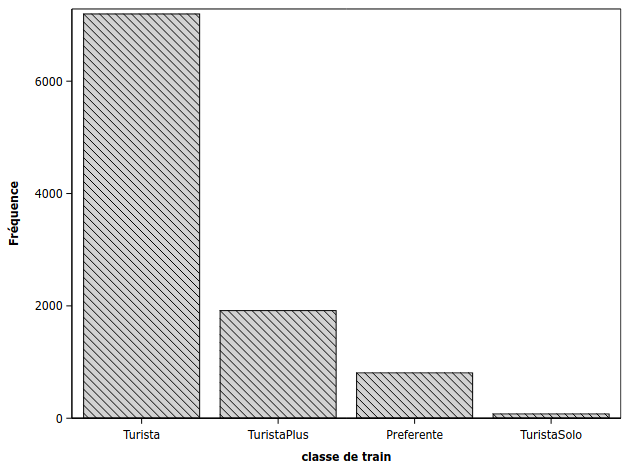
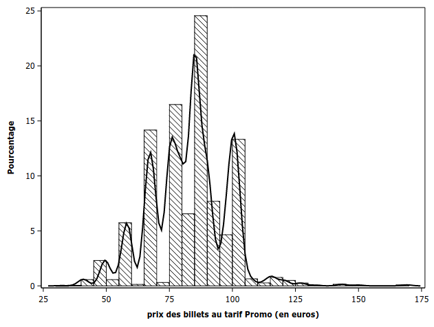
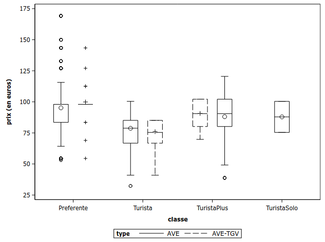
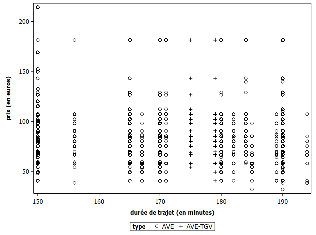

```{r child = "setup.Rmd"}
```

```{r set-theme, include=FALSE}
library(xaringanthemer)
style_duo_accent(
  primary_color      = "#003C71", # pantone classic blue
  secondary_color    = "#009FDF", # pantone baby blue
  header_font_google = google_font("Raleway","700"),
  text_font_google   = google_font("Raleway", "400", "400i"),
  code_font_google   = google_font("Source Code Pro"),
  text_font_size     = "30px"
)
```


```{r load-packages, message=FALSE, echo=FALSE}
knitr::opts_chunk$set(echo = TRUE, 
                      message = FALSE, 
                      warning = FALSE, 
                      out.width = '70%', 
                      fig.align = 'center', 
                      tidy = FALSE)
options(scipen = 1, digits = 3)
library(ggplot2, warn.conflicts = FALSE, quietly = TRUE)
library(poorman, quietly = TRUE)
library(viridis)
theme_set(theme_minimal())
options(ggplot2.continuous.colour="viridis")
options(ggplot2.continuous.fill = "viridis")
scale_colour_discrete <- scale_colour_viridis_d
scale_fill_discrete <- scale_fill_viridis_d

url <- "https://lbelzile.bitbucket.io/MATH60604/renfe.sas7bdat"
renfe <- haven::read_sas(url)
#Identifier les variables catégorielles
renfe <- renfe %>% 
  mutate(dest = factor(recode(dest, "0" = "Barcelone-Madrid",
               "1" = "Madrid-Barcelone")),
         type = factor(type),
         dest = factor(dest),
         jour = factor(jour),
         tarif = factor(tarif),
         classe = factor(classe))
```

```{r xaringanExtra, echo=FALSE}
xaringanExtra::use_xaringan_extra(c("tile_view", "editable","panelset", "webcam"))
htmltools::tagList(
  xaringanExtra::use_clipboard(
    button_text = "<i class=\"fa fa-clipboard\"></i>",
    success_text = "<i class=\"fa fa-check\" style=\"color: #90BE6D\"></i>",
    error_text = "<i class=\"fa fa-times-circle\" style=\"color: #F94144\"></i>"
  ),
  rmarkdown::html_dependency_font_awesome()
)
xaringanExtra::use_extra_styles(
  hover_code_line = TRUE,         #<<
  mute_unhighlighted_code = TRUE  #<<
)
```

# Types de données

Vos base de données incluent plusieurs *types de variable*.

Il faut faire la distinction entre ces dernières 

- pour la modélisation,
- pour la représentation graphique,
- pour l'interprétation adéquate des effets.

---


## Types de données numériques

```{r variablesquanti, echo = FALSE, out.width="55%"}
knitr::include_graphics('img/EDA/continuous_discrete.png')
```


.center[
.small[
Illustration par Allison Horst de variables numériques continues (gauche) et discrètes (droite).
]
]

---

## Types de données catégorielles

```{r variablescateg, echo = FALSE}
knitr::include_graphics('img/EDA/nominal_ordinal_binary.png')
```
.center[
.small[
Illustration par Allison Horst de variables catégorielles nominales (gauche), ordinales (centre) et binaires (droite).
]
]

---

## Graphiques et données


> *Un simple graphique transmet plus d'information à l'analyste que n'importe quel autre option*  
.right[— John Tukey]

--

### Qu'est ce qu'un bon graphique?

> *communique des idées complexes avec clarté, précision et efficacité ... [le graphique] qui offre au lecteur le plus grand nombre d'idées le plus rapidement possible avec le moins d'encre et le plus petit espace possible*  
.right[— Tufte, 1983]


---

## Grammaire des graphiques

> Wilkinson, L. (2005), *The Grammar of Graphics(2nd ed.)* Statistics and Computing, New York: Springer.


- Éléments (couches):
    - données
    - transformation (variable -> esthétique)
    - objets géométriques
    - transformations
    - positionnement
- Échelle / guide
- Coordonnées (facettes, système de coordonnés)


---

Voici quelques règles d'or pour une visualisation effective


### Règle 1: le choix du graphique dépend du type de variable


--
<br>

#### Une seule variable 


.midi[
- continue: histogramme/densité
- discrète: diagramme en bâton
- catégorielle: diagramme en bâton (fréquence ou pourcentage)
]

--

#### Deux variables
.midi[
- continues: nuage de points
- catégorielles: diagramme à bande (avec couleurs), carte thermique
- continue $\times$ catégorielle: boîte à moustache, graphique violon
]

---

.panelset[


.panel[.panel-name[Graphiques **R**]

.center[.small[Diagramme en bâtons pour la classe des billets de trains du jeu de données Renfe]]
```{r renfe_barplot, eval = TRUE, echo = FALSE}
ggplot(data = renfe, 
       aes(x = forcats::fct_infreq(classe))) + 
  geom_bar() +
  geom_text(stat='count', aes(label=..count..), vjust=-0.5) +
  labs(x = "classe", 
       y = "dénombrement")  +
  scale_y_continuous(expand = c(.125, 0)) + 
  theme(panel.grid.major.x = element_blank())
```

]
.panel[.panel-name[Code **R**]

#### Une seule variable catégorielle: diagramme en bâton

```{r renfe_barplot_code, eval = FALSE, echo = TRUE}
ggplot(data = renfe, 
       aes(x = forcats::fct_infreq(classe))) + 
  geom_bar() +
  geom_text(stat='count', aes(label=..count..), vjust=-0.5) +
  labs(x = "classe", 
       y = "dénombrement")  +
  scale_y_continuous(expand = c(.125, 0)) + 
  theme(panel.grid.major.x = element_blank())
```
.small[
- On ordonne les valeurs selon la fréquence.
- Si les étiquettes sont trop longues, faites une rotation via `+ coord_flip()`.
]
]

.panel[.panel-name[Graphique **SAS**]


```{r renfe_barplot_sas, echo = FALSE, out.width="55%"}

```

]

.panel[.panel-name[Code **SAS**]

```{sas renfe_barplot_sas_code, eval = FALSE, echo = TRUE}
proc sgplot data=modstat.renfe;
vbar classe / categoryorder=respdesc;
xaxis label="classe de train";
run;
```

]

]

---

.panelset[

.panel[.panel-name[Graphiques **R**]

.center[
.small[Histogramme du prix des billets au tarif Promo de trains du jeu de données Renfe
]
]
```{r renfe_hist, eval = TRUE, echo = FALSE}
renfe %>% subset(tarif == "Promo") %>%
  ggplot(aes(x = prix)) + 
    geom_histogram(aes(y = ..density..), bins = 30) +
    geom_density() + 
    geom_rug(sides = "b") + 
    labs(x = "prix de billets au tarif Promo (en euros)", 
         y = "densité") 
```

]
.panel[.panel-name[Code **R**]

#### Une seule variable continue: histogramme et/ou densité 

```{r renfe_hist_code, eval = FALSE, echo = TRUE}
renfe %>% subset(tarif == "Promo") %>%
  ggplot(aes(x = prix)) + 
    geom_histogram(aes(y = ..density..), bins = 30) +
    geom_density() + 
    geom_rug(sides = "b") + 
    labs(x = "prix de billets au tarif Promo (en euros)", 
         y = "densité") 
```

]


.panel[.panel-name[Graphique **SAS**]

```{r renfe_hist_sas, echo = FALSE, out.width="55%"}

```

]

.panel[.panel-name[Code **SAS**]

```{sas renfe_hist_sas_code, eval = FALSE, echo = TRUE}
data renfe_promo;
set modstat.renfe;
where tarif ="Promo";
run;

proc sgplot data=renfe_promo noautolegend;
histogram prix;
density prix / type=kernel;
xaxis label = "prix des billets au tarif Promo (en euros)";
run;
```
]


]

---

.panelset[
.panel[.panel-name[Graphiques **R**]

.center[
.small[
Boîte à moustache du prix des billets au tarif Promo en fonction de la classe pour le jeu de données Renfe
]
]

```{r renfe_boxplot, cache = TRUE, echo = FALSE, out.width="55%"}
renfe %>% subset(tarif == "Promo") %>%
    ggplot(aes(y = prix, x = classe, col = type)) + 
    geom_boxplot() + 
    labs(y = "prix (en euros)", col = "type de train") + 
    theme(legend.position = "bottom") +
    scale_colour_viridis_d()
```

]
.panel[.panel-name[Code **R**]


#### Deux variables (continue et catégorielle): boîte à moustache

```{r renfe_boxplot_code, echo = TRUE, eval = FALSE}
renfe %>% subset(tarif == "Promo") %>%
    ggplot(aes(y = prix, x = classe, col = type)) + 
    geom_boxplot() + 
    labs(y = "prix (en euros)", col = "type de train") + 
    theme(legend.position = "bottom") + 
    scale_colour_viridis_d()
```

.small[

- On ajoute une autre variable catégorielle (`type`) à l'aide de la couleur.
- On utilise une palette de couleurs adéquate (daltonisme, impression noir et blanc).
]

]


.panel[.panel-name[Graphique **SAS**]

```{r renfe_boxplot_sas, echo = FALSE, out.width="55%"}

```

]

.panel[.panel-name[Code **SAS**]

```{sas renfe_boxplot_sas_code, eval = FALSE, echo = TRUE}
proc sgplot data=renfe_promo;
vbox prix / category=classe group=type;
yaxis label = "prix (en euros)";
run;
```
]


]
---

.panelset[

.panel[.panel-name[Graphiques **R**]

.center[
.small[
Nuage de points du prix en fonction du temps de trajet annoncé pour les billets de train à grande vitesse du jeu de données Renfe
]
]

```{r renfe_nuagepts, cache = TRUE, echo = FALSE, out.width="55%"}
renfe %>% subset(type != "REXPRESS") %>%
    ggplot(aes(x = duree, y = prix, col = type)) + 
    geom_point() + 
    labs(y = "prix (en euros)", 
         x = "durée de trajet (en minutes)",
         col = "type de train") + 
    theme(legend.position = "bottom") +
    scale_colour_viridis_d()
```

]
.panel[.panel-name[Code **R**]


#### Deux variables (continues) et une variable catégorielle: nuage de points


```{r renfe_nuagepts_code, echo = TRUE, eval = FALSE}
renfe %>% subset(type != "REXPRESS") %>%
    ggplot(aes(x = duree, y = prix, col = type)) + 
    geom_point() + 
    labs(y = "prix (en euros)", 
         x = "durée de trajet (en minutes)",
         col = "type de train") + 
    theme(legend.position = "bottom") +
    scale_colour_viridis_d()
```

.midi[
Qu'est-ce qui cloche dans la représentation graphique précédente?

Comment pourrait-on remédier aux problèmes soulevés?
]

]

.panel[.panel-name[Graphique **SAS**]

```{r renfe_nuagepts_sas, echo = FALSE, out.width="55%"}

```

]

.panel[.panel-name[Code **SAS**]

```{sas renfe_nuagepts_sas_code, eval = FALSE, echo = TRUE}
data renfe_ave;
set modstat.renfe;
where type NE "REXPRESS";
run;

proc sgplot data=renfe_ave;
scatter y=prix x=duree / group=type;
xaxis label="durée de trajet (en minutes)";
yaxis label="prix (en euros)";
run;
```
]

]

---


### Règle 2: soignez les apparences

Votre graphique doit être interprétable uniquement avec la légende.

- certaines visualisations sont plus effectives/adéquates que d'autres
- inclure les noms de variables **et** les unités
- ajouter une description dans le texte et faire une référence croisée
- attention à la lisibilité (taille de police adéquate)

---

### Règle 3: Portez une attention particulière à la perception visuelle humaine

+ ratio longueur/largeur
+ espace entre bandes
+ étendu des axes (incluant ou pas zéro)
+ choix de couleurs (noir/blanc avec contraste, palette pour daltoniens)
+ comparaison d'aires/superficies (difficile)
+ graphiques 3D / avec rotation: à éviter

---


# Analyse exploratoire graphique des données


> *Les résumés numériques focalisent l'attention sur les valeurs attendues, les résumés graphiques sur les valeurs inattendues.*   
.right[— John Tukey]

- Poser des questions en lien avec les données
- Chercher les réponses à l'aide de graphiques
- Infirmer/confirmer nos intuitions
- Raffiner les questions suite aux observations
- Répéter le processus
- Écrire un résumé des trouvailles et aspects importants


---

.discussion[## Atelier]

Considérons en groupe l'analyse exploratoire des données `diamants`.

.pull-left[
### Questions

.can-edit[-]
]
.pull-right[
### Résumé

.can-edit[-]

]
---
### Références

- [*Fundamentals of Data Visualization* par Claus O. Wilke](https://serialmentor.com/dataviz/)
- [Chapitre 3 de _**R** for Data Science_ par Garrett Grolemund et Hadley Wickham](https://r4ds.had.co.nz/)
- [Chapitre 1 de *Data Visualization: A practical introduction* par Kieran Healy](https://socviz.co/lookatdata.html#lookatdata)
